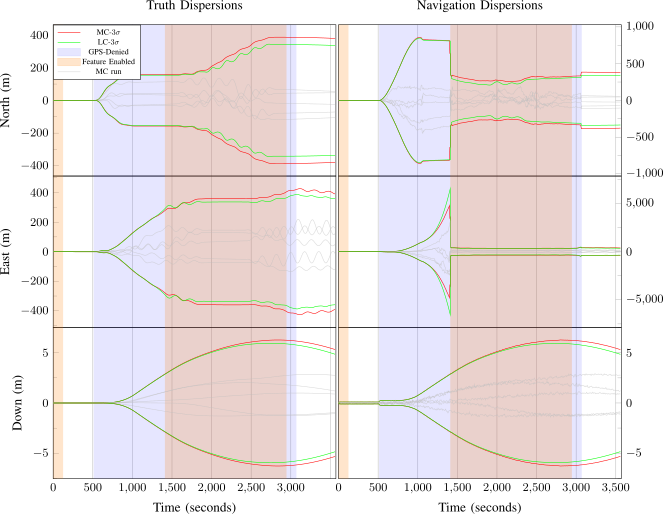
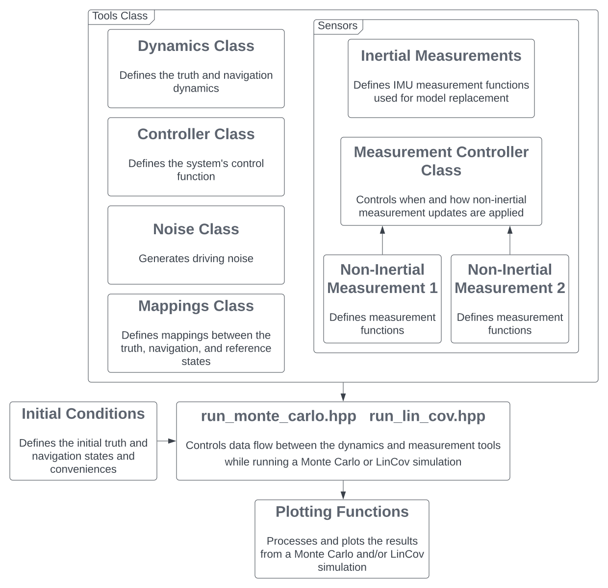

# Kalman Filter

In this C++-based Ament package the Kalman Filter equations are implemented.
This includes the state propagation equations, measurement update equations, functions for running Monte Carlo and LinCov simulations, functions for generating error budgets, and functions for plotting the meaningful statistics after running a Mote Carlo or LinCov simulation.
Some example results are given below.
All of these functionalities have been designed with performance in mind and to be as usable as possible for any arbitrary problem you may be working on.



This package also contains various sensor, dynamic models, and controllers that can be used with the Kalman Filter code.
These predefined dynamic models include a one dimensional rocket sled model similar to that of [[1](#1)] and a fixed-wing aircraft model based on the Dubins Airplane described in [[2](#2)].
The predefined controllers include a proportional and a finite-time LQR controller for the rocket sled model and a proportional derivative controller for the airplane model.

Code Architecture Diagram


## Dependencies

This package is intended to be used in a [ROS 2](https://docs.ros.org/en/jazzy/index.html) Colcon workspace.
Other then Ament, which can be installed with the rest of the ROS 2 distribution you're using [here](https://docs.ros.org/en/jazzy/Installation.html), the following command will install all system dependencies on an Ubuntu system.

```bash
sudo apt install libeigen3-dev libomp-dev libboost-all-dev libblas-dev liblapack-dev libtbb-dev libjemalloc2 libjemalloc-dev
```
Additionally, this package is dependent on another of my repositories found here: https://github.com/james-swedeen/matplotlibcpp.


## Rocket Sled Demonstration

This package includes two simple demonstrations of how to use the code provided to perform Monte Carlo and LinCov simulations, then plot the results.
The demonstration code can be found at [rocket_sled_demo.cpp](src/rocket_sled_demo.cpp) and [finite_time_lqr_evaluation.cpp](src/finite_time_lqr_evaluation.cpp).

The dynamics used in the demonstration are of a one-dimensional rocket sled with measurements of position and velocity.
The dynamics used were borrowed from [[1](#1)] with the following changes

  * The truth and navigation models include position as the integral of velocity.
  * A measurement on the position of the UAV has been added so the position variance remains bounded.
  * The differential drag term on the dynamics of the velocity term has been left out for simplicity.

Once the code has been built and the workspace sourced, the rocket sled example with a simple state feedback control law with a desired position and velocity can be ran with the following command.
```bash
    ros2 run kalman_filter rocket_sled_demo
```
To run a similar set of simulations where the controller used has been replaced with a finite-time LQR implementation, run the next command.
```bash
    ros2 run kalman_filter finite_time_lqr_evaluation
```
Both of these programs will run 250 Monte Carlo simulations and a linear covariance analysis of the systems and plot the results.
The programs will not end until all of the generated plots are closed.


## Gauss Markov Fitting Demonstration

Using the same dynamics as the rocket sled demonstration with the simple feedback controller, the following demonstration will show how to approximately fit the position truth state covariance with a first order Gauss Markov model.
It performs the parameter fitting to the data gathers from a set of Monte Carlo runs with an implementation of non-linear least squares.
Then is propagates the Gauss Markov model and plots the resulting error from the averaged Monte Carlo results.

To run the demonstration execute the following command.
```bash
    ros2 run kalman_filter gauss_markov_fitting_demo
```
The program will not end until all of the generated plots are closed.

## References
<a id="1">[1]</a>
Christensen RS, Geller D. Linear covariance techniques for closed-loop guidance navigation and control system design and analysis. Proceedings of the Institution of Mechanical Engineers, Part G: Journal of Aerospace Engineering. 2014;228(1):44-65. doi:10.1177/0954410012467717

<a id="2">[2]</a>
R. Beard and T. McLain, Small Unmanned Aircraft: Theory and Practice. Princeton University Press, 2012. [Online]. Available: https://books.google.com/books?id=YqQtjhPUaNEC

